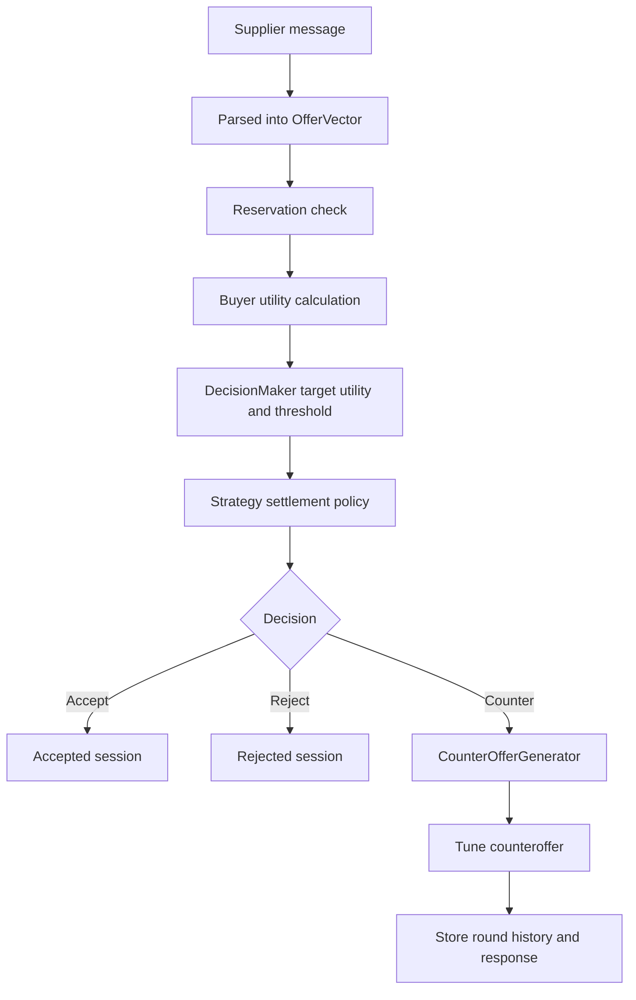
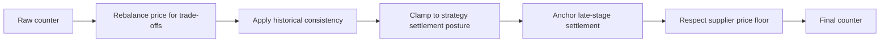

# Negotiation Engine Math

This document explains the negotiation engine as a mathematical system and ties that explanation back to the actual classes in the codebase.

Use this page when you want to answer questions like:

- How is a supplier offer turned into a utility score?
- How does the engine decide `ACCEPT`, `COUNTER`, or `REJECT`?
- Where do `Baseline`, `Meso`, `Boulware`, `Conceder`, and `Tit-for-Tat` differ mathematically?
- How is a counteroffer generated from the current state?

For the higher-level prose version, see [negotiation-engine.md](negotiation-engine.md).

## Code map

The main logic story lives in these files:

- [../backend/src/main/java/org/GLM/negoriator/negotiation/NegotiationEngine.java](../backend/src/main/java/org/GLM/negoriator/negotiation/NegotiationEngine.java)
- [../backend/src/main/java/org/GLM/negoriator/negotiation/NegotiationEngineImpl.java](../backend/src/main/java/org/GLM/negoriator/negotiation/NegotiationEngineImpl.java)
- [../backend/src/main/java/org/GLM/negoriator/negotiation/BuyerUtilityCalculator.java](../backend/src/main/java/org/GLM/negoriator/negotiation/BuyerUtilityCalculator.java)
- [../backend/src/main/java/org/GLM/negoriator/negotiation/BuyerPreferenceScoring.java](../backend/src/main/java/org/GLM/negoriator/negotiation/BuyerPreferenceScoring.java)
- [../backend/src/main/java/org/GLM/negoriator/negotiation/Normalization.java](../backend/src/main/java/org/GLM/negoriator/negotiation/Normalization.java)
- [../backend/src/main/java/org/GLM/negoriator/negotiation/DecisionMaker.java](../backend/src/main/java/org/GLM/negoriator/negotiation/DecisionMaker.java)
- [../backend/src/main/java/org/GLM/negoriator/negotiation/StrategySettlementPolicy.java](../backend/src/main/java/org/GLM/negoriator/negotiation/StrategySettlementPolicy.java)
- [../backend/src/main/java/org/GLM/negoriator/negotiation/CounterOfferGenerator.java](../backend/src/main/java/org/GLM/negoriator/negotiation/CounterOfferGenerator.java)
- [../backend/src/main/java/org/GLM/negoriator/application/NegotiationApplicationService.java](../backend/src/main/java/org/GLM/negoriator/application/NegotiationApplicationService.java)
- [../backend/src/test/java/org/GLM/negoriator/negotiation/StrategySimulationMatrixTest.java](../backend/src/test/java/org/GLM/negoriator/negotiation/StrategySimulationMatrixTest.java)

## Engine picture



The engine is deterministic once the supplier offer has been parsed into structured terms. AI can help with parsing and buyer-facing wording, but the deal decision itself is rule-based.

## Core data model

The engine works with a small set of domain records in `NegotiationEngine.java`:

- `OfferVector(price, paymentDays, deliveryDays, contractMonths)`
- `IssueWeights(price, paymentDays, deliveryDays, contractMonths)`
- `BuyerProfile(idealOffer, reservationOffer, weights, reservationUtility)`
- `NegotiationContext(round, maxRounds, strategy, state, riskOfWalkaway, history)`
- `NegotiationRequest(...)`
- `NegotiationResponse(...)`

Mathematically, the buyer profile defines two corners of the buyer's acceptable region:

- `idealOffer`: the buyer's best commercial point
- `reservationOffer`: the buyer's walk-away limit on each issue

That means every supplier offer is evaluated inside a bounded issue space rather than against an open-ended objective.

## Weight normalization

Before any scoring happens, the raw issue weights are normalized by `IssueWeights.normalized()`:

```java
return new IssueWeights(
    price.divide(totalWeight, SCALE, RoundingMode.HALF_UP),
    paymentDays.divide(totalWeight, SCALE, RoundingMode.HALF_UP),
    deliveryDays.divide(totalWeight, SCALE, RoundingMode.HALF_UP),
    contractMonths.divide(totalWeight, SCALE, RoundingMode.HALF_UP));
```

In math form:

```text
w'i = wi / sum(w)
```

with the constraints:

- `wi >= 0`
- `sum(w) > 0`

This matters because the utility function should depend on relative importance, not on whether the input weights happened to sum to `1.0`.

## Offer normalization

The per-issue normalization helpers live in `Normalization.java`, and the buyer-facing direction rules live in `BuyerPreferenceScoring.java`.

The buyer prefers:

- lower price
- longer payment terms
- faster delivery
- shorter contract length

So each issue is mapped to `[0,1]` with direction-aware formulas:

```text
priceScore    = clamp((reservationPrice - offerPrice) / (reservationPrice - idealPrice))
paymentScore  = clamp((offerPayment - reservationPayment) / (idealPayment - reservationPayment))
deliveryScore = clamp((reservationDelivery - offerDelivery) / (reservationDelivery - idealDelivery))
contractScore = clamp((reservationContract - offerContract) / (reservationContract - idealContract))
```

The `clamp()` step guarantees the result stays in `[0,1]`.

This makes the issues comparable. A two-day delivery improvement and a three-euro price improvement do not live on the same native scale, but after normalization they can be combined in one utility function.

## Buyer utility function

The main scoring rule is implemented in `BuyerUtilityCalculator.calculate()`:

```java
BigDecimal utility = weightedPrice
    .add(weightedPayment)
    .add(weightedDelivery)
    .add(weightedContract);
```

In math form:

```text
U_buyer(offer) =
  w'price    * priceScore
+ w'payment  * paymentScore
+ w'delivery * deliveryScore
+ w'contract * contractScore
```

This is an additive weighted utility model. The assumption behind it is that each issue contributes separably after normalization. That is a simplification, but it gives three strong properties:

- transparency
- configurability
- deterministic behavior

### Worked example

Using the defaults from `NegotiationDefaults.java`:

- ideal offer: `price 90`, `payment 60`, `delivery 7`, `contract 6`
- reservation offer: `price 120`, `payment 30`, `delivery 30`, `contract 24`
- weights: `0.40`, `0.20`, `0.25`, `0.15`

For supplier offer `price 108`, `payment 45`, `delivery 14`, `contract 12`:

```text
priceScore    = (120 - 108) / (120 - 90) = 12 / 30     = 0.4000
paymentScore  = (45 - 30) / (60 - 30)   = 15 / 30     = 0.5000
deliveryScore = (30 - 14) / (30 - 7)    = 16 / 23     = 0.6957
contractScore = (24 - 12) / (24 - 6)    = 12 / 18     = 0.6667

U_buyer =
  0.40 * 0.4000
+ 0.20 * 0.5000
+ 0.25 * 0.6957
+ 0.15 * 0.6667
= 0.5339
```

So the offer is middling for the buyer: clearly better than the reservation edge, but still far from ideal.

## Decision curve over time

The decision policy is split between `DecisionMaker.java` and `StrategySettlementPolicy.java`.

The first step is round progress:

```text
progress = clamp(round, 1, maxRounds) / maxRounds
```

Then `DecisionMaker.targetUtility()` applies a strategy-specific concession curve:

```java
double target = switch (context.strategy()) {
    case BASELINE -> 1.0d - progress;
    case MESO -> 1.0d - Math.pow(progress, 1.35d);
    case BOULWARE -> 1.0d - Math.pow(progress, 2.4d);
    case CONCEDER -> 1.0d - Math.sqrt(progress);
    case TIT_FOR_TAT -> titForTatTarget(progress, context);
};
```

In math form:

```text
Baseline   : T(p) = 1 - p
Meso       : T(p) = 1 - p^1.35
Boulware   : T(p) = 1 - p^2.4
Conceder   : T(p) = 1 - sqrt(p)
TitForTat  : T(p) = baseline - reciprocityBonus + firmnessPenalty
```

The final target is:

```text
targetUtility = max(strategyTarget, reservationUtility)
```

That means a strict buyer floor can override a soft strategy.

`DecisionMaker` also computes a hard reject threshold by strategy. That threshold is not the same as the acceptance target. It defines how weak an offer can be before the negotiation becomes too poor to keep open indefinitely.

## Decision rule

The initial decision rule from `DecisionMaker.evaluate()` is:

```text
if U_buyer >= targetUtility:
    ACCEPT
else if round >= maxRounds:
    REJECT
else if U_buyer < hardRejectThreshold:
    COUNTER
else:
    COUNTER
```

That is only the first layer. `NegotiationEngineImpl.negotiate()` then refines the result with extra policy:

- hard per-issue reservation limits
- near-boundary slack rules
- strategy settlement posture

So the engine is not just "utility above line equals accept." It is a layered control system.

## Settlement policy

`StrategySettlementPolicy.thresholds()` adds two more quantities:

- `minimumUtility`
- `maximumPrice`

These create a strategy-specific settlement posture beyond the time-based target curve.

The key signal is `supplierConcessionFraction`, which measures how much the supplier has improved relative to its anchor offer:

```text
c =
  clamp(
    (currentUtility - anchorUtility)
    /
    (maximumUtilityAtAnchorPrice - anchorUtility)
  )
```

The resulting settlement thresholds are:

```text
minimumUtility = max(reservationUtility, strategyUtilityFloor(strategy, c))
maximumPrice   = idealPrice + priceSpan * strategyPriceRatio(strategy, c)
```

This is where the strategies become meaningfully different in settlement posture:

- `Boulware` keeps a smaller price ceiling and higher utility floor
- `Conceder` allows a larger price ceiling and lower utility floor
- `Tit-for-Tat` relaxes when the supplier makes meaningful concessions

An offer is only truly acceptable if it passes both:

```text
U_buyer >= minimumUtility
offerPrice <= maximumPrice
```

That prevents the engine from accepting a deal that is "good enough for this round" but inconsistent with the intended behavior of the chosen strategy.

## Counteroffer generation

When the engine decides to counter, the raw counter logic lives in `CounterOfferGenerator.java`.

The first step is issue ranking by weighted normalized gap:

```text
gap_i = (distance_to_ideal_i / span_i) * normalizedWeight_i
```

Blocked issues are assigned zero gap if supplier constraints say that issue cannot move further.

That means the engine asks:

```text
Which remaining issue hurts the buyer most, adjusted for both scale and importance?
```

The core ranking logic is highlighted below:

```java
gapByIssue.put(
    NegotiationIssue.PRICE,
    weightedGap(
        positiveGap(supplierOffer.price(), ideal.price()),
        BuyerPreferenceScoring.priceSpan(profile),
        weights.price()));
```

The selected issue then moves halfway toward the buyer ideal:

```java
BigDecimal moved = current.add(target)
    .divide(new BigDecimal("2"), 2, RoundingMode.HALF_UP);
```

For integers:

```java
int moved = current + ((target - current) / 2);
```

This midpoint rule is simple but effective. It ensures the buyer moves, but does not jump immediately to the ideal.

There are two important refinements:

- if the supplier ignored the buyer's previous push on the same issue, another issue can be promoted if it is close enough in importance
- in `MESO`, the engine can return several viable counters instead of just one

## Counter tuning

The raw counter is further refined in `NegotiationEngineImpl.tuneCounterOffer()`:



This tuning stage matters because the engine is not only optimizing a static objective. It is also preserving negotiation credibility.

### Price rebalancing

If the supplier improved non-price terms, the buyer can give back some price while staying ahead overall:

```text
utilityGivebackBudget = recentSupplierConcessionUtility * 0.35
maxUtilityGiveback    = counterUtility - supplierOfferUtility - 0.0100
allowedGiveback       = min(utilityGivebackBudget, maxUtilityGiveback)
```

That utility giveback is then converted into a price increase:

```text
deltaPrice = (allowedGiveback / priceWeight) * priceSpan
```

This is a mathematically clean form of reciprocity.

### Historical consistency

`applyHistoricalConsistency()` prevents the buyer from contradicting earlier concessions when the supplier is offering an equivalent or better package on the other issues.

That gives the engine a memory of its own commitments. Without this step, a counteroffer algorithm can become numerically rational but behaviorally inconsistent.

## Evaluation metrics

`NegotiationEngineImpl` also computes supporting metrics:

- estimated supplier utility
- continuation value
- Nash product

These do not directly decide the outcome, but they are important for reasoning, debugging, and analytics.

Estimated supplier utility is computed from supplier-archetype beliefs and bounds-normalized issue utilities:

```text
U_supplier_est =
  weighted average of
  {
    price utility,
    payment utility,
    delivery utility,
    contract utility
  }
```

Continuation value is:

```text
continuationValue = targetUtility * (1 - riskOfWalkaway)
```

Nash product is:

```text
nashProduct =
  max(U_buyer - buyerReservationUtility, 0)
  *
  max(U_supplier_est - supplierReservationUtility, 0)
```

These metrics help explain whether a deal looks efficient or whether the buyer is better off continuing.

## Validation

The strategy trade-offs are validated in `StrategySimulationMatrixTest.java`.

That test does not just check formulas in isolation. It runs deterministic scenario matrices and verifies that the strategies are behaviorally distinct:

- `Boulware` preserves more buyer utility on accepted deals than `Baseline`
- `Baseline` preserves more than `Conceder`
- `Conceder` tends to settle earlier than `Baseline`
- `Baseline` tends to settle earlier than `Boulware`

This is important because it shows that the mathematical differences in the engine are large enough to produce real policy differences, not just cosmetic naming differences.

## Summary

The negotiation engine is a layered mathematical policy:

1. Normalize heterogeneous issues into a common utility space.
2. Aggregate them into a weighted buyer utility score.
3. Compare that score against a strategy-shaped time-dependent target.
4. Filter the result through hard reservation limits and settlement posture.
5. If needed, generate and tune a counteroffer that moves toward the buyer ideal without breaking credibility or constraints.

That is why the engine is more than a scoring function. It is a deterministic state transition model for multi-issue negotiation.
